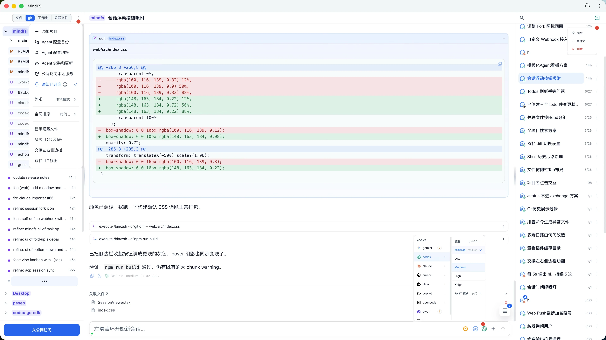
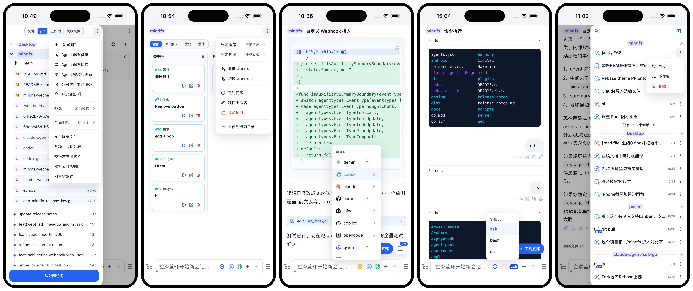

# MindFS

[English](./README.md) | [简体中文](./README.zh.md)

> **AI Agent Remote Access Gateway · Result Visualization**

Access your personal AI agents and workstation data anywhere, anytime through MindFS.

---

## Screenshots

<p align="center">
  
</p>
<p align="center">
  
</p>

---

## Features

### Agent Sessions

- **Multi-Agent support**: Claude Code · OpenAI Codex · Gemini CLI · Cursor · GitHub Copilot · Cline · Augment · Kimi · Kiro · Qwen · Qoder · OMP · Pi · Hermes · OpenCode · OpenClaw — installed agents are detected automatically.
- **Real-time streaming**: Token-by-token output pushed to the browser; tool calls, thought traces, permission prompts, and remaining context-window capacity are rendered live as structured, collapsible cards.
- **Flexible switching**: Switch agents or models mid-session; all agents share the same context — no need to re-explain the background.
- **Session search**: Search by session title or conversation content, then jump straight to the matched session and snippet.
- **External session both-way import&synchronization**: Browse existing sessions from supported agent CLIs, import one into MindFS, and continue it as a native MindFS session. MindFS session can resumed in agent cli too. Bidirectional synchronization is also possible.
- **Binding persistence and recovery**: MindFS persists the mapping between its internal session and the underlying agent session, so the link can be restored after service restarts and follow-up messages continue on the same agent session when available.
- **Rich media input**: Attach files and images directly in your messages.
- **Multi-device sync**: Access the same instance from multiple devices simultaneously with live session sync.
- **Configuration backup and switching**: Agent configurations can be backed up and switched with one click, making it easier to move between multiple accounts or API keys.
- **Subagents**: Codex subagents are automatically discovered and displayed.

### File Access

- **Multiple projects**: Manage several directories at once; sessions are organized per project and stay independent.
- **Self-hosted data**: All conversation history, file metadata, and view config are stored under the project's `.mindfs/` subdirectory — migration and backup is just a folder copy.
- **File tree browser**: Full directory navigation with file preview; Markdown, images, and code all have dedicated renderers.

### Interaction

- **`/` slash commands**: Type `/` to trigger a command palette and quickly run preset operations.
- **`@` file references**: Type `@` to trigger path completion and attach any file as context for the agent.
- **`#` quick prompts**: Type `#` to trigger your saved prompt shortcuts inline.
- **Bidirectional file–session linking**: Jump from a file to the session that created it, or from a session to all files it touched.
- **Android, Browser app (PWA)**: Install to desktop or mobile home screen for a native-like experience — no app store required.
- **Mobile-optimized UI**: Bottom action bar within thumb reach, independent panel swipe navigation, input box adapts to the soft keyboard.

### Access Modes

- **Local mode**: Accessible in the browser on the local machine immediately after startup — no account or configuration needed.
- **Relay remote mode**: Access your local instance from anywhere on the public internet without opening firewall ports, via an encrypted tunnel through [a9gent.com](https://a9gent.com). Click the bind button in the local UI to activate.
- **Private channel**: Use a private network (e.g. Tailscale) and access directly via `ip:port`.
- **End-to-end encryption**: Sessions and files can be protected with end-to-end encryption.

### Plugin System

- **Custom views**: A plugin is a custom view for a file, following the pattern: receive file content → parse → render UI.
- **Agent-generated plugins**: Tell the agent "implement a txt novel reader" and it generates the plugin — all txt files are then displayed as a reading experience.
- **Interaction loop**: Plugins can register action buttons that send structured commands to the agent, completing the loop: customize plugin → browse file → agent interaction.

### Command Execution

- **Card output**: Command results are displayed as cards for clearer reading.
- **History suggestions**: Matching previous commands automatically appear as suggestions for quick input.
- **Screen-width adaptation**: Command output adapts to the screen width for a friendlier result view.
- **Selectable shell type**: Choose the shell used for command execution, so Windows users do not need to worry about shell type mismatches.
- **Session persistence**: Each session gets a long-lived shell, making tmux-like command continuity easier.

### Installation

- **Single binary**: The production build is a statically compiled binary with all web assets embedded, and the install package is under 10 MB.
- **Zero dependencies**: No Node.js, Docker, or daemon manager required on the host.
- **Cross-platform**: macOS (Intel + Apple Silicon), Linux (x86-64, ARM64, ARMv7), Windows (x86-64, ARM64).

---

## Quick Start

### Prerequisites

MindFS does not include any AI model — you need at least one Agent CLI installed locally. Choose what works for you:

| Agent | Install |
|-------|---------|
| **Claude Code** | https://code.claude.com/docs/en/quickstart |
| **OpenAI Codex** | https://developers.openai.com/codex/cli |
| **Gemini CLI** | https://geminicli.com/ |
| **Cursor** | https://cursor.com/cn/cli |
| **GitHub Copilot** | https://github.com/features/copilot/cli |
| **Cline** | https://cline.bot/kanban |
| **Augment** | https://www.augmentcode.com/product/CLI |
| **Kiro** | https://kiro.dev/cli/ |
| **OpenCode** | https://opencode.ai/ |
| **OpenClaw** | https://docs.openclaw.ai/ |
| **Kimi** | https://www.kimi.com/code/docs/kimi-cli/guides/getting-started.html |
| **Qwen** | https://qwen.ai/qwencode |
| **Qoder** | https://docs.qoder.com/cli/quick-start |
| **OMP** | https://github.com/can1357/oh-my-pi (`omp acp`) |
| **Pi** | https://github.com/badlogic/pi-mono/tree/main/packages/coding-agent, and acp adatper: https://github.com/svkozak/pi-acp |
| **Hermes** | https://hermes-agent.nousresearch.com/docs/user-guide/features/acp |

Once an agent is installed, start MindFS and interact with it through the browser.

### Install

**macOS / Linux**
```bash
curl -fsSL https://raw.githubusercontent.com/a9gent/mindfs/main/scripts/install.sh | bash
```

Custom install path:
```bash
curl -fsSL https://raw.githubusercontent.com/a9gent/mindfs/main/scripts/install.sh | bash -s -- --prefix your/path
```

**Windows (PowerShell)**
```powershell
irm https://raw.githubusercontent.com/a9gent/mindfs/main/scripts/install.ps1 | iex
```

The install script auto-detects your OS and architecture, reads the latest version from the first line of [`release-notes.md`](https://raw.githubusercontent.com/a9gent/mindfs/main/release-notes.md), then downloads the matching binary from [GitHub Releases](https://github.com/a9gent/mindfs/releases). `release-notes.md` keeps release history with the newest entry at the top; `make release TAG=v1.2.3` commits and pushes it when changed, then uses only the top entry as the GitHub release notes.

**Build from source** (requires Go 1.22+, Node.js 20+)
```bash
git clone https://github.com/a9gent/mindfs.git
cd mindfs
make build      # output: ./mindfs
```

### Run

```bash
mindfs                        # manage current directory
mindfs /path/to/your/project  # manage a specific directory
mindfs -addr :9000 /path/to/your/project  # custom port
```

Open [http://localhost:7331](http://localhost:7331) in your browser.

#### HTTPS (TLS)

Enable HTTPS with a self-signed certificate (auto-generated and reused across restarts):

```bash
mindfs -tls
mindfs -tls -addr :9000 /path/to/your/project
```

Open [https://localhost:7331](https://localhost:7331) in your browser. The auto-generated certificate includes SANs for `localhost`, `127.0.0.1`, `::1`, and all non-loopback interface IPs, so LAN clients can connect without certificate name mismatches. Certificates are stored under the user config directory (e.g., `~/.config/mindfs/` on Linux).

Use custom certificate and key files:

```bash
mindfs -tls -cert /path/to/cert.pem -key /path/to/key.pem
```

MindFS automatically detects the availability of installed agents. This usually takes about one minute.

### Enable Remote Access (Optional)

1. Open MindFS in local mode and click the bind button in the bottom-left corner.
2. Log in to [a9gent.com](https://a9gent.com) and confirm the binding.
3. Open your node — it is now accessible from any device.

### CLI Reference

```bash
mindfs [flags] [root]
```

`root` is the directory to manage. If omitted, MindFS opens without adding a directory.

By default, `mindfs` starts or reuses a background service and opens the browser. Pass `root` to register a directory; if a service is already running on the selected address, the command reuses it and adds that directory.

#### Common Commands

```bash
mindfs
mindfs /path/to/project
mindfs -addr :9000 /path/to/project
mindfs -foreground /path/to/project
mindfs -status
mindfs -version
mindfs -stop
mindfs -restart
mindfs -remove /path/to/project
```

#### Flags

| Flag | Default | Description |
|------|---------|-------------|
| `-addr string` | `127.0.0.1:7331` | Listen address. Use `:7331` or `0.0.0.0:7331` to allow LAN access. |
| `-foreground` | `false` | Run the server in the foreground instead of starting a background service. |
| `-status` | `false` | Show background service status, PID, URL, and log file path. |
| `-version` | `false` | Show the current MindFS version. |
| `-stop` | `false` | Stop the background service for the selected address. |
| `-restart` | `false` | Stop the background service if present, then start it again. |
| `-remove` | `false` | Remove `root` from the managed directory list. If the server is running, it is removed through the local API; otherwise it is removed from the local registry. |
| `-no-relayer` | `false` | Disable relay integration. Local and private-network access still work. |
| `-e2ee` | `false` | Enable end-to-end encryption for sensitive data. The pairing code can also be used as an authentication mechanism: unpaired frontends cannot access node content. LAN access requires `-tls` to work correctly. On first enablement, the CLI prints the pairing secret. |
| `-tls` | `false` | Enable HTTPS. If `-cert` and `-key` are not provided, MindFS generates and reuses a local self-signed certificate. |
| `-cert string` | empty | TLS certificate file in PEM format. Used with `-tls`; auto-generated when empty. |
| `-key string` | empty | TLS private key file in PEM format. Used with `-tls`; auto-generated when empty. |

---

## Contributing

Pull requests are welcome. For larger changes, please open an issue first to discuss the approach.


---

## License

[AGPL v3](LICENSE)

## Friend Links
<a href="https://linux.do">Linux.do</a>
